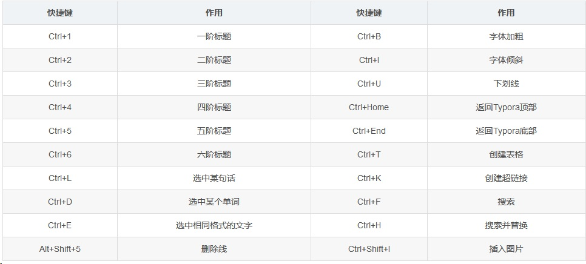

# Typora常用汇总

[TOC]

## 1、对文字的特殊标识

### (1)、标题

标题是用“#”实现的，标题前面加一个“#”，代表一级标题；依次类推，标题前面加六个“#”代表六级标题；一共有六级标题，编辑各种文档完全够用。

### (2)、下划线

<u>快捷键Ctrl+u,即可实现下划线功能。</u> 

### (3)、强调

**在要强调内容前后分别加**两个**“*”号。**

### (4)、斜体

内容前后分别加**一个**“*”号。

*斜体* 

### (5)、删除线

先转化成英文输入法，再把内容前后分别加上**两个**“~”号。

~~这是一条删除线~~ 

### (6)、高亮

==高亮显示==

### (7)、注释

这是一个注释[^1] 

## 2、列表

### (1)、有序列表

输入数字“1”+“.”+空格 ， 自动开始有序列表。

1.  有序列表第一行
2.  有序列表第二行
3.  有序列表第三行

### (2)、无序列表

输入“+”或“-”或“*”+空格，自动开始无序列表。

+   无序列表第一行
+   无序列表第二行
+   无序列表第三行

## 3、表格

Ctrl+T,在弹出的对话框中选择行列数，自动生成列表。
还可以很方便地对表格进行编辑。

|      |      |      |
| :--- | :--- | ---- |
|      |      |      |
|      |      |      |
|      |      |      |

## 4、分割线

输入三个或三个以上“-”（“*”），再按回车键，即出现一条分割线。

---

## 5、插入

### (1)、图片 

插入本地图片：直接把图片拖入即可；
插入网络图片：![图片标题]（图片链接）


### (2)、超链接

+   语法1（行内式链接）

    [百度][https://www.baidu.com/]

+   语法2（参考式链接）

    [CSDN][CSDN网址]

    [CSDN网址]:https://www.csdn.net/

+   语法3（自动链接）

+   <https://github.com/>

### (3)、数学公式 

“$$”+回车。

### (4)、代码

行内代码：代码的两端各加一个“`”号，（在Tab键上面，英文输入法）。
代码块：输入三个“~”，按回车键，即可选择编程语言。

`printf("Hello World\n");`

~~~c
#include<stdio.h>
int main(void){
	printf("Hello World\n");
	return 0;
}
~~~

### (5)、目录

`[toc]`

[TOC]

## 6、符号的输入

\\   反斜线
\`   反引号
\*   星号
\_   底线
\{ \}  花括号
\[ \]  方括号
\( \)  括弧
\#   井字号
\+   加号
\-   减号
\.   英文句点
\!   惊叹号


## 8、快捷键




## 9、数学公式

### (1)、添加数学公式

+   点击“插入”—>“公式块”
+   “$$”+回车 （公式块，行间公式）
+   $$ （行内公式）

### (2)、常用公式的代码

#### 上/下标

| 算式   | Markdown |
| ------ | -------- |
| $x^2 $ | x^2      |
| $y_1 $ | y_1      |

#### 分式

|     算式      |  Markdown   |
| :-----------: | :---------: |
|      1/2      |     1/2     |
| $\frac{1}{2}$ | \frac{1}{2} |

#### 省略号

|   算式   | Markdown |
| :------: | :------: |
| $\cdots$ |  \cdots  |

#### 开根号

|    算式    | Markdown |
| :--------: | :------: |
| $\sqrt{2}$ | \sqrt{2} |

#### 矢量

|   算式    | Markdown |
| :-------: | :------: |
| $\vec{a}$ | \vec{a}  |

#### 积分

|        算式         |     Markdown      |
| :-----------------: | :---------------: |
|     $\int{x}dx$     |     \int{x}dx     |
| $\int_{1}^{2}{x}dx$ | \int_{1}^{2}{x}dx |

#### 极限

|               算式                |            Markdown             |
| :-------------------------------: | :-----------------------------: |
|            $\lim{a+b}$            |            \lim{a+b}            |
| $\lim_{n\rightarrow+\infty}{a+b}$ | \lim_{n\rightarrow+\infty}{a+b} |

#### 累加

|          算式           |       Markdown        |
| :---------------------: | :-------------------: |
|        $\sum{a}$        |        \sum{a}        |
| $\sum_{n=1}^{100}{a_n}$ | \sum_{n=1}^{100}{a_n} |

上下限：
$$
\sum_{i=1}^{l-1}k_{i}+1, \sum_{i=1}^{l-1}k_{i}+2, \cdots , \sum_{i=1}^{l-1}k_{i}+k_{l}
$$

~~~
\sum_{i=1}^{l-1}k_{i}+1, \sum_{i=1}^{l-1}k_{i}+2, \cdots , \sum_{i=1}^{l-1}k_{i}+k_{l}
~~~

使用 \limits
$$
\sum\limits_{i=1}^{l-1}k_{i}+1, \sum\limits_{i=1}^{l-1}k_{i}+2, \cdots , \sum\limits_{i=1}^{l-1}k_{i}+k_{l}
$$

```
\sum\limits_{i=1}^{l-1}k_{i}+1, \sum\limits_{i=1}^{l-1}k_{i}+2, \cdots , \sum\limits_{i=1}^{l-1}k_{i}+k_{l}
```


#### 累乘

|          算式           |       Markdown        |
| :---------------------: | :-------------------: |
|       $\prod{x}$        |       \prod{x}        |
| $\prod_{n=1}^{99}{x_n}$ | \prod_{n=1}^{99}{x_n} |

#### 希腊字母

|            |          |               |             |
| :--------: | :------: | :-----------: | :---------: |
|    大写    | Markdown |     小写      |  Markdown   |
|  $\Alpha$  |  \Alpha  |   $\alpha$    |   \alpha    |
|  $\Beta$   |  \Beta   |    $\beta$    |    \beta    |
|  $\Gamma$  |  \Gamma  |   $\gamma$    |   \gamma    |
|  $\Delta$  |  \Delta  |   $\delta$    |   \delta    |
| $\Epsilon$ | \Epsilon |  $\epsilon$   |  \epsilon   |
|            |          | $\varepsilon$ | \varepsilon |
|  $\Zeta$   |  \Zeta   |    $\zeta$    |    \zeta    |
|   $\Eta$   |   \Eta   |    $\eta$     |    \eta     |
|  $\Theta$  |  \Theta  |   $\theta$    |   \theta    |
|  $\Iota$   |  \Iota   |    $\iota$    |    \iota    |
|  $\Kappa$  |  \Kappa  |   $\kappa$    |   \kappa    |
| $\Lambda$  | \Lambda  |   $\lambda$   |   \lambda   |
|   $\Mu$    |   \Mu    |     $\mu$     |     \mu     |
|   $\Nu$    |   \Nu    |     $\nu$     |     \nu     |
|   $\Xi$    |   \Xi    |     $\xi$     |     \xi     |
| $\Omicron$ | \Omicron |  $\omicron$   |  \omicron   |
|   $\Pi$    |   \Pi    |     $\pi$     |     \pi     |
|   $\Rho$   |   \Rho   |    $\rho$     |    \rho     |
|  $\Sigma$  |  \Sigma  |   $\sigma$    |   \sigma    |
|   $\Tau$   |   \Tau   |    $\tau$     |    \tau     |
| $\Upsilon$ | \Upsilon |  $\upsilon$   |  \upsilon   |
|   $\Phi$   |   \Phi   |    $\phi$     |    \phi     |
|            |          |   $\varphi$   |   \varphi   |
|   $\Chi$   |   \Chi   |    $\chi$     |    \chi     |
|   $\Psi$   |   \Psi   |    $\psi$     |    \psi     |
|  $\Omega$  |  \Omega  |   $\omega$    |   \omega    |

#### 三角函数

|  算式  | Markdown |
| :----: | :------: |
| $\sin$ |   \sin   |

#### 对数函数

|   算式    | Markdown |
| :-------: | :------: |
|  $\ln2$   |   \ln2   |
| $\log_28$ | \log_28  |
|  $\lg10$  |  \lg10   |

#### 关系运算符

|  运算符   | Markdown |
| :-------: | :------: |
|   $\lt$   |   \lt    |
|   $\gt$   |   \gt    |
|   $\ne$   |   \ne    |
|   $\le$   |   \le    |
|   $\ge$   |   \ge    |
| $\times$  |  \times  |
|  $\div$   |   \div   |
| $\plusmn$ | \plusmn  |
|  $\cdot$  |  \cdot   |
| $\equiv$  |  \equiv  |

#### 其他特殊字符

|       符号        |  Markdown  |
| :---------------: | :--------: |
|     $\forall$     |  \forall   |
|     $\infty$      |   \infty   |
|    $\emptyset$    | \emptyset  |
|     $\exists$     |  \exists   |
|     $\nabla$      |   \nabla   |
|      $\bot$       |    \bot    |
|     $\angle$      |   \angle   |
|    $\because$     |  \because  |
|   $\therefore$    | \therefore |
| $a\quad b$ (空格) |   \quad    |

花括号：
$$
c(u)=\begin{cases} \sqrt\frac{1}{N}，u=0\\ \sqrt\frac{2}{N}， u\neq0\end{cases}
$$

```
c(u)=\begin{cases} \sqrt\frac{1}{N}，u=0\\ \sqrt\frac{2}{N}， u\neq0\end{cases}  
```


#### 矩阵

不带括号的矩阵:

代码之后的tag实现了后标
$$
\begin{matrix}
   1 & 2 & 3 \\
   4 & 5 & 6 \\
   7 & 8 & 9
  \end{matrix} \tag{1}
$$

```
$$
  \begin{matrix}
   1 & 2 & 3 \\
   4 & 5 & 6 \\
   7 & 8 & 9
  \end{matrix} \tag{1}
$$
```

带括号{}的矩阵:
$$
\left\{
 \begin{matrix}
   1 & 2 & 3 \\
   4 & 5 & 6 \\
   7 & 8 & 9
  \end{matrix}
  \right\} \tag{2}
$$

```
$$
 \left\{
 \begin{matrix}
   1 & 2 & 3 \\
   4 & 5 & 6 \\
   7 & 8 & 9
  \end{matrix}
  \right\} \tag{2}
$$
```

带括号[]的矩阵:
$$
\left[
 \begin{matrix}
   1 & 2 & 3 \\
   4 & 5 & 6 \\
   7 & 8 & 9
  \end{matrix}
  \right] \tag{3}
$$

~~~
$$
 \left[
 \begin{matrix}
   1 & 2 & 3 \\
   4 & 5 & 6 \\
   7 & 8 & 9
  \end{matrix}
  \right] \tag{3}
$$
~~~

不使用left和right关键词:
$$
\begin{bmatrix}
   1 & 2 & 3 \\
   4 & 5 & 6 \\
   7 & 8 & 9
  \end{bmatrix} \tag{4}
$$

~~~
$$
 \begin{bmatrix}
   1 & 2 & 3 \\
   4 & 5 & 6 \\
   7 & 8 & 9
  \end{bmatrix} \tag{4}
$$
~~~

而对于大括号而言：
$$
\begin{Bmatrix}
   1 & 2 & 3 \\
   4 & 5 & 6 \\
   7 & 8 & 9
  \end{Bmatrix} \tag{5}
$$

~~~
$$
 \begin{Bmatrix}
   1 & 2 & 3 \\
   4 & 5 & 6 \\
   7 & 8 & 9
  \end{Bmatrix} \tag{5}
$$
~~~

带省略号的矩阵:
$$
\left[
\begin{matrix}
 1      & 2      & \cdots & 4      \\
 7      & 6      & \cdots & 5      \\
 \vdots & \vdots & \ddots & \vdots \\
 8      & 9      & \cdots & 0      \\
\end{matrix}
\right]
$$

~~~
$$
\left[
\begin{matrix}
 1      & 2      & \cdots & 4      \\
 7      & 6      & \cdots & 5      \\
 \vdots & \vdots & \ddots & \vdots \\
 8      & 9      & \cdots & 0      \\
\end{matrix}
\right]
$$
~~~

带参数的矩阵:

这里笔者希望在矩阵中画出一条分割线，以强调最右侧一列的特殊性。
其中`\begin{array}{cc|c}`中的c表示居中对齐元素；
$$
\left[
    \begin{array}{cc|c}
      1 & 2 & 3 \\
      4 & 5 & 6
    \end{array}
\right] \tag{7}
$$

~~~
$$ 
\left[
    \begin{array}{cc|c}
      1 & 2 & 3 \\
      4 & 5 & 6
    \end{array}
\right] \tag{7}
$$
~~~

行间矩阵:

表示将矩阵写在一行文本之中，这样不会占用太多的篇幅

啦啦啦$\bigl(
\begin{smallmatrix}
l&l\\j&z
\end{smallmatrix}
\bigr)$叽叽喳喳 

~~~
啦啦啦$\bigl(
    \begin{smallmatrix}
		l&l\\j&z
	\end{smallmatrix}
\bigr)$叽叽喳喳 
~~~


## 参考资料：

https://blog.csdn.net/mingzhuo_126/article/details/79941450

https://www.jianshu.com/p/a6a6a22e9393

https://blog.csdn.net/mingzhuo_126/article/details/82722455

https://blog.csdn.net/u011491972/article/details/53998980

https://blog.csdn.net/qq_38228254/article/details/79469727


[^1]: www.baidu.com