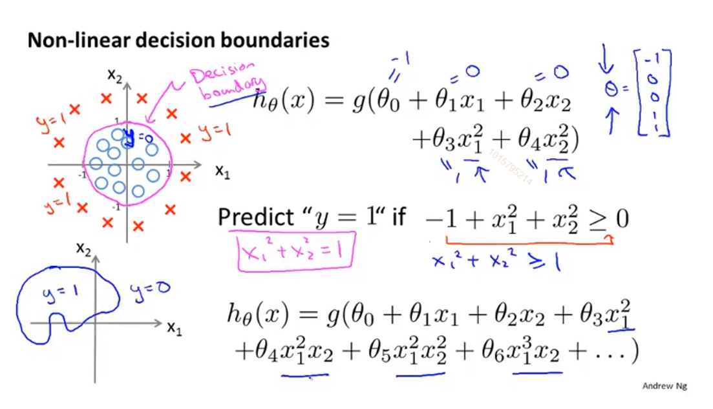
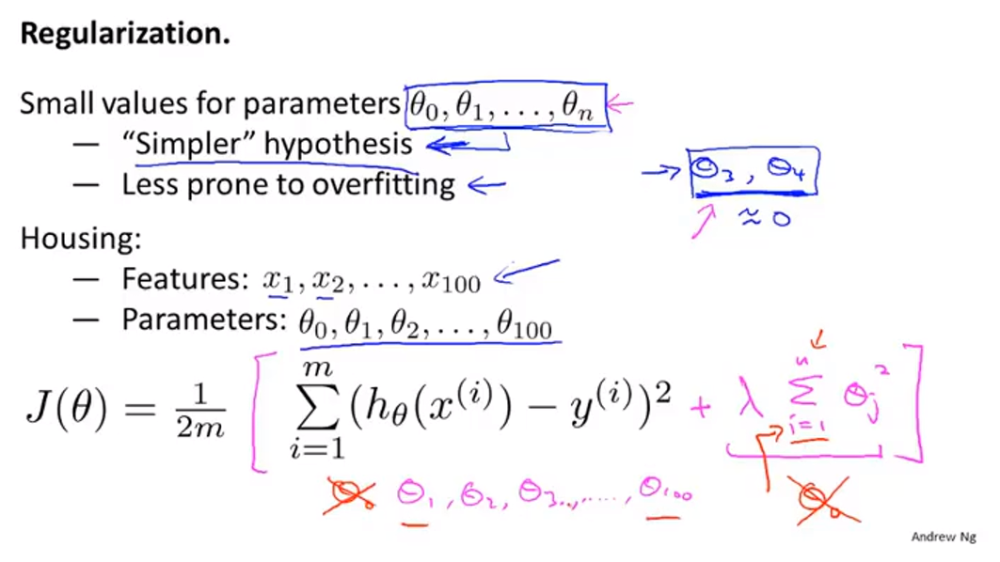
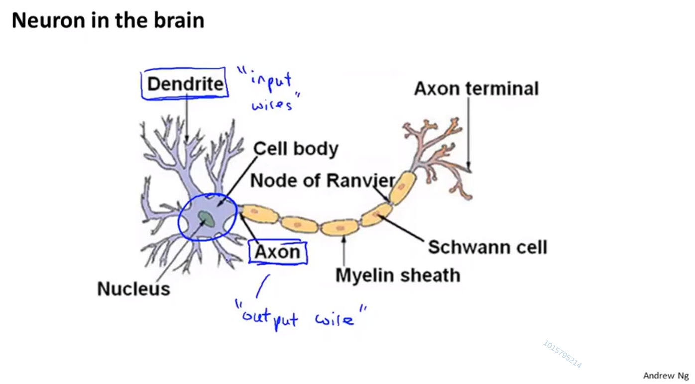

# 									机器学习

[TOC]

## 符号定义：

m ： 训练样本的数量。

x ： 输入变量（或者说特征）。

y ： 输出变量（目标变量）。

$(x,y)$ ： 表示一个训练样本。

$(x^{(i)},y^{(i)})$ ：表示第i个样本。

h：假设函数。

n：特征值的数量。

$x^{(i)}$ 第 $i$ 个训练样本的特征值。（特征值可能有多个）

$x^{(i)}_j$ 第 $i$ 个训练样本中第 $j$ 个特征量的值。

## 一、绪论：初识机器学习

### 	1、机器学习的定义

> ​	Arthur Samuel：在没有明确设置的情况下，使计算机具有学习能力的研究领域。（相对陈旧，不正式）

>   ​	==Tom Mitchell：计算机程序从经验E中学习，解决某一任务T，进行某一性能度量P，通过P测定在T上的表现因经验E而提高。==
>
>   

### 2、机器学习学习算法的分类

​			机器学习中学习算法最主要的两类是监督学习和无监督学习。

#### 		2.1 监督学习

​		==监督学习是指，我们给算法一个数据集，其中包含了正确答案，算法的目的就是给出更多的正确答案。==

##### 2.1.1 回归问题

回归问题的输出是连续型变量，是一种定量输出（预测明天的气温是多少度）。

此图中的问题便是监督学习中的回归问题，通过给定英尺与价格的数据集对房价进行预测（给定英尺预测多少钱）。

##### 2.1.2 分类问题

分类问题的输出是离散型变量（如+1、-1），是一种定性输出（预测明天是）。

此图中的问题便是监督学习中的分类问题，通过给定肿瘤尺寸与是否为恶性肿瘤相对应的数据集，对肿瘤进行预测（给定尺寸的肿瘤为恶性还是良性）。

#### 2.2 无监督学习

​	==无监督学习是指数据集中没有标记（或都为一种标记），算法需要自行寻找数据中的结构。==

##### 聚类算法

​	将没有标记（或都为一种标记）的数据集分成不同的集合（簇）。

一个聚类算法典型的应用就是谷歌新闻：

谷歌新闻每天自动检索数以万计的新闻，并自动将他们聚合成一个个专题，每个专题由不同网站（大概率）的同类新闻组成。

##### 鸡尾酒会算法

有这样一个场景，有一场两个人的鸡尾酒会，两个人在同时说话。同时有两个位置不同的麦克风，那么两个麦克风中所录的音频就会不同（距离不同音量不同），通过鸡尾酒会算法可以将通过两个音频，将两个人的声音分别提取出来，并去除其他杂音。

## 二、单变量线性回归

只含有一个特征（输入变量）的线性回归问题。（两个变量之间存在一次方函数关系，就称它们之间存在线性关系）

### 1、监督学习算法的工作原理

首先，我们向学习算法提供训练集（比如我们的房价训练集），学习算法的任务是输出一个==函数h（假设函数）==，假设函数（hypothesis）的作用是把房子的大小作为输入变量把它作为x的值，而它会试着输出相应房子的预测y值，==h是一个引导从x得到y的函数==。接下来要决定怎么表示这个假设函数h。假设图中的假设函数表示为：

​                                                              $h_{\theta}(x) = \theta_0 + \theta_1x$ 

（函数$h_{\theta}(x)$有时会缩写为$h(x)$）

这就意味着我们要预测的 y 是一个关于 x 的线性函数。

==这种模型被称为线性回归模型。==

这个例子是一个一元线性回归，被称为==单变量线性回归模型==。

### 2、代价函数

假设有一个数据集表示房屋的面积与房价（如图3所示），若模型是一个单变量线性回归模型，表示为：

​                                                             $h_{\theta}(x) = \theta_0 + \theta_1x$ 

那么我们要做的，就是选择合适的 $\theta_0$ 和 $\theta_1$ ，是模型与所给的函数尽可能的拟合，以保证以后预测数据的准确性。

线性回归问题便成了一个最小化的问题，求合适的 $\theta_0$ 和 $\theta_1$ ，使得

​                                                             $\frac{1}{2m}\sum\limits_{i=1}^{m}(h_{\theta}(x^{(i)})-y^{(i)})^2$ 

的值最小，这将是我的线性回归的整体目标函数。

按照惯例，我们要定义一个代价函数：

​                                               $ J(\theta_0,\theta_1) =\frac{1}{2m}\sum\limits_{i=1}^{m}(h_{\theta}(x^{(i)})-y^{(i)})^2$ 

求适当的 $\theta_0$ 和 $\theta_1$ ，使得代价函数的值最小。

代价函数也被称为平方误差函数。

之所以要求误差的平方和，是因为误差平方代价函数对于大多数问题，特别是回归问题，都是一个合理的选择。还有其他的代价函数也能很好的发挥作用，但平方误差代价函数可能是解决线性回归问题最常用的手段。

假设使 $\theta_0=0$  来简化假设函数 $h_{\theta}(x)$ ，那么它的代价函数 $J(\theta_0,\theta_1)$ 如右边所示，是一个碗状。而若 $\theta_0!=0 $ ，那么它的代价函数 $J(\theta_0,\theta_1)$ 也是一个碗状，如下图所示：

通常为了方便也使用等高线图来表示：

### 3、梯度下降

梯度下降是一种可以将代价函数 $J$ 最小化的算法。它不仅可以对线性回归模型的代价函数进行最小化，还被广泛应用于机器学习的其他领域，对其他函数进行最小化。

以下便是梯度下降的应用场景：

有这样一个函数 $J(\theta_0,\theta_1)$ （泛指的函数，不一定非要是代价函数），想要求得函数 $J(\theta_0,\theta_1)$ 的最小值。

然后便是梯度下降的步骤，梯度下降以一个初始值为开始，一般将 $\theta_0 = 0 , \theta_1 = 0$ ，然后对 $\theta_0,\theta_1$ 来进行变化以减少函数 $J$ 的值，不断进行这一步直到收敛到了最小值或局部最小值。

下面表示梯度下降的过程：

如图所示，梯度下降有这样的一个特点，一开始选取不同的初始值，可能最后收敛于不同的局部最小值。

梯度下降的具体算法如图所示：

​                                                   $\theta_j:=\theta_j-\alpha\frac{\partial}{\partial\theta_j}J(\theta_0,\theta_1)  \quad(for \quad j=0 \quad and \quad j=1)$ 

其中 $:=$ 的意思就是平常编程语言中的等号，是一个赋值符号，而 = 就是日常中的判断符号。

 $\alpha$ 称为学习速率，用来控制以多大的幅度更新这个参数 $\theta_j$ （梯度下降的速度）， $\alpha $ 的值越大，梯度下降的速度越快。

其中这个更新是对$\theta_0$ 和 $\theta_1$ 两个参数都要更新，而且是要同时更新，如图中下方左边所示。右边的不是同时更新，在某些数据集或者模型中不一定错误，但已经称不上梯度下降算法了。   

下面直观的了解下偏导项 $\frac{\partial}{\partial\theta_1}J(\theta_0,\theta_1)$:

假设 $\theta_0 = 0$ ，那么代价函数 $J$ 的函数如下图所示： 

那么偏导项就变成了 $\frac{\partial}{\partial\theta_1}J(\theta_1)$ ，而偏导项其实就是函数在 $\theta_1$ 那一点的斜率，假设 $\theta_1$ 这一点在最低点的右边，那么导数的值是一个正数，也就是一个正斜率，那么根据公式 $\theta_1:=\theta_j-\alpha\frac{\partial}{\partial\theta_1}J(\theta_1)$ ，$\theta_1$ 会向左移动，正是最低点的方向。同理若是在最低点的左边，那么偏导项是一个负数，也就是一个负斜率，那么根据公式 $\theta_1$ 会向右移动，也正是最低点的方向。

而 $\alpha$ 的作用就是控制每次下降的幅度，若 $\alpha$ 数值过小，那么下降的速度欧就会很慢。而若 $\alpha$ 的数值过大，那么最坏的情况就是可能会无法收敛甚至发散。

而若到了最低点，因为最低点的导数为 0 ，所以 $\theta_1 = \theta_1-\alpha0 = 0$ ，也就是不会变化。 

随着梯度的下降，斜率不断减小，下降的速度也会不断减小。

下面将梯度下降应用到之前所学的线性回归模型中的代价函数中：

那么重点要求的就是偏导项，学过高数就可以轻松推出下图求导后的公式：

本节讲的梯度下降算法因为每一步都使用了所有的数据集，所以又称为 Batch梯度下降算法。

## 三、线性代数回顾

### 1、矩阵和向量

矩阵是指由数字组成的矩形阵列，并写在方括号内。

矩阵可以说是二维数组的另一种说法。

矩阵的维数写作矩阵的行数乘以列数。（左边便是一个 $4\times 2$ 的矩阵）

也有这样一种写法：

将左边的矩阵写作 $R^{4\times2}$ ，将该矩阵称为集合 $R^{4\times2}$ 的元素，也就是说， $R^{4\times2}$ 代表所有$4\times2$ 的矩阵的集合。		

向量是指列数为1的矩阵。

如图 y 表示一个向量，向量的维数由向量的行数决定，y 便是一个4维向量。

$R^4$ 是指一个4维向量的集合。

$y_1$ 表示向量 y 中的第一个元素。

一般有下标从1开始和从0开始两个写法，机器学习的应用中一般用从0开始，本课程默认从1开始。

按惯例来说，用大写字母表示矩阵，用小写字母表示向量。

### 2、加法和标量乘法

两矩阵相加就是两矩阵对应位置的元素相加，因此，只有维度相同的两矩阵可以相加，维度不同的矩阵相加没有意义。

标量乘法中标量是一个复杂的结构，可能是一个数或者实数。标量乘法就是用这个标量乘矩阵中的每个元素。

### 3、矩阵向量乘法

矩阵和向量相乘：

在实际应用中，可以如上图这样使用。

有一组数据集（关于房价的）和一个假设函数 $h_{\theta}(x)$ ，那么计算预测值可以如图中这样列为一个矩阵和一个向量相乘。

### 4、矩阵乘法

假设有一个数据集，三个假设函数，那么计算预测值可以如下图列矩阵：

### 5、矩阵乘法的特性

（1）、矩阵乘法不满足交换律：

​                                            $A \times B \ne B \times A$ 

（2）、矩阵乘法满足结合律：

​                                           $A \times B \times C = (A \times B) \times C = A \times (B \times C)$ 

（3）、矩阵乘以单位矩阵等于原矩阵：

​                                          $A \times I = I \times A = A $      （ $I$ 为单位矩阵）

### 6、逆和转置

（1）、矩阵的逆：

如果 $A$ 是一个 $m \times m$ 的矩阵，如果 $A$ 有逆矩阵，那么

​                                         $AA^{-1} = A^{-1}A = I $ 

（2）、矩阵的转置运算：

​                                        $A = \begin{bmatrix}1&2&0\\3&5&9\end{bmatrix} \quad \quad \quad A^T = \begin{bmatrix}1&3\\2&5\\0&9\end{bmatrix}$     

定义：

假设 $A$ 是一个 $m \times n$ 的矩阵，并设矩阵 $B$ 等于 $A$ 的转置，那么 $B$ 是一个 $n \times m$ 的矩阵，并且 $B_{ij} = A_{ji}$ 。

## 四、多变量线性回归

适用于多变量或者多特征量的情况。

### 1、多功能

若只有一个变量那我们的假设函数是这样的。

而若有多个特征值，那么假设函数就变为了：

​                                            $h_\theta(x) = \theta_0+\theta_1x_1+\theta_2x_2+\theta_3x_3+...+\theta_nx_n$ 

为了方便表示，我们假设了一个并不存在的特征值 $x_0$ ,且 $x_0$ 恒为 $1$ ，那么 $x$ 就可以表示为一个 $n+1$ 维的向量：

​                                                                 $x = \begin{bmatrix}x_0\\x_1\\x_2\\ \vdots\\x_n\end{bmatrix} \in R^{n+1} $ 

同时参数 $\theta$ 也可以表示为一个 $n+1$ 维的向量：

​                                                                 $\theta = \begin{bmatrix}\theta_0\\\theta_1\\\theta_2\\ \vdots\\\theta_n\end{bmatrix} \in R^{n+1} $ 

那么假设函数就变成了：

​                                         $h_\theta(x) = \theta_0x_0+\theta_1x_1+\theta_2x_2+\theta_3x_3+...+\theta_nx_n$ 

​                                                      $=\theta^Tx$ 

### 2、多元梯度下降法

#### 2.1、定义

多变量线性回归模型的代价函数定义如下：

和单变量梯度下降法类似，多变量梯度下降法的具体过程如下：

（记得为同步更新）

#### 2.2特征缩放

特征缩放就是让多个特征值在近似的范围之内，进行梯度下降。

以上图左边两个特征值为例， $x_1$ 的范围是 $0-2000$ ， $x_2$ 的范围是 $1-5$ ，那么不考虑 $\theta_0$ ，代价函数的等高线图如上图左边所示，因为 $x_1,x_2$ 的范围差距极大，所以是一个狭长的椭圆形，那么梯度下降的过程如红线所示，就会左右来回震荡，下降速度缓慢。所以为提高下降速度，将 $x_1$ 的数值除以2000， $x_2$ 的数值除以5，那么等高线图如右图所示，是一个正圆，梯度下降的速度也就较左边快得多。

把特征值缩放到 -1到1的范围就可以了，不过要求并不十分严格，只要近似就好了，以老师的经验，最大-3到3都是OK的，最小 $-\frac{1}{3} $ 到 $\frac{1}{3}$ 就可以。

除了将特征值除以最大值之外，在特征缩放中有时也会进行一项称为均值归一化的工作。

均值归一化就是将特征值 $x_i$ 替换为 $x_i-\mu_i$ ，使你的特征值具有为0的平均值。

一个一般化的公式就是这样：

​                                                                     $\frac{x_i-\mu_i}{s_i} \rightarrow x_i$    

其中 $\mu_i$ 就是 $x_i$ 取值范围的中位数， $s_i$ 就是 $x_i$ 的区间长度（最大值减最小值）。

==注意：由于特征值缩放的目的是减少梯度下降的路径以加快梯度下降的速度，所以特征值缩放的精度并不精确，只要是大体的范围之内便可。==

#### 2.3学习率

对于一个多变量的梯度下降算法，我们如何判断结果是否已经收敛呢？

如上图左边所示，代价函数根据迭代次数的变化映射在图中，由图可知，在300次迭代知乎，代价函数下降的值小的可以忽略不计，这时便称已经收敛。

由于不同场景所需的迭代次数差别非常大，所以我们不能仅仅根据迭代次数进行判断，一般是画出右图这样的函数图，根据函数曲线进行判断。

或者如右图所示，有这样的一个自动测试程序，当迭代后下降的小于一个给定的很小很小的值 $\epsilon$ ，便视为已经收敛。

不过由于这样的一个 $\epsilon$ 的值很难确定，所以推荐使用左边的方法，即画出函数曲线。

通过画出代价函数的下降曲线可以很方便的看出代价函数是否在正确运行。

如上图中左上的函数，代价函数的值在不断下降，这时我们一般应该选取一个更小的学习率 $\alpha$ 值，因为导致该图的原因一般为选取的 $\alpha$ 值过大，超过了最小值，并不断左右震荡上升（如右图橙线所示）。

对于左下的函数，也应选取一个更小的函数，数学家已经证明过了，课上没有证明。

==对于一个足够小的 $\alpha$ 值，在所有的迭代中代价函数的值都会下降。不过如果 $\alpha$ 的值过小，代价函数收敛就会很慢。==

总结一下：

==如果 $\alpha$ 的值过小，那么代价函数的收敛就会很慢。==

==而如果 $\alpha$ 的值过大，那么代价函数的值在每次迭代中不一定会下降，代价函数也可能不会收敛。==

老师选取 $\alpha$ 的方法，一般是找到一个对于该代价函数来说过大的 $\alpha$ 中最小的一个，以及对于该代价函数来说过小的 $\alpha$ 中最大的一个，然后在该区间内以3的倍数寻找 $\alpha$ ，这样一般能找到一个比较合理的 $\alpha$ 。

### 3、特征和多项式回归

本节要讨论多个不同的特征如何选取合适的特征，以及如何得到不同的算法。当选择了合适的特征后，这些算法往往是非常有效的。

多项式回归能够用线性回归的方法进行拟合非常复杂的函数，甚至是非线性函数。

以预测房价为例：

上图的例子给了我们临街宽度 $x_1$ 和纵向深度 $x_2$ 两个特征，但我们很直观的可以知道，和房价更相关的是房屋面积，所以我们可以只用两者的乘积，即房屋面积这一个特征。有时可以通过定义一个新特征，可以得到一个更好的模型。

与选择特征密切相关的一个概念，被称为多项式回归。

比如有如图所示的房价数据集，通过观察数据集你觉得直线并不能很好的拟合数据，因此你很容易就会想到二次模型，但你很快会觉得二次模型不合理，因为二次函数会降下来，但随着房屋面积的增大，房屋的价格并不会降下来。所以可能我们会选择不同的多项式模型，并转而选择一个三次函数。我们用这个三次函数的式子可以得到这样的模型（绿色），这个模型和数据集拟合的更好，因为最终不会下降。

那么我们如何进行拟合呢？

我们将 $size$ 作为 $x_1$ ， $size^2$ 作为 $x_2$ ， $size^3$ 作为 $x_3$ ，这样来进行拟合。

因为这个模型是一个三次模型，所以特征缩放就非常重要。

事实上我们有很大的余地来选择使用哪些特征，如上图我们可以平方根函数来进行拟合。

### 4、正规方程

正规方程对于某些线性回归问题，可以提供更好的方法来求得参数 $\theta$ 的最优值。

与梯度下降这种一步一步迭代求出 $\theta$ 最优值的解法不同，正规方程提供了一种可以一步直接求出 $\theta$ 最优值的解析法。

以最简单的一种情况为例：

假设 $J(\theta)$ 是一个 $\theta$ 为标量的二次函数，那么如果求最低点的 $\theta$ 值呢？

学过微积分就很容易可以想到，对 $J(\theta)$ 进行求导，求出令 $J'(\theta)=0$ 的那一点的 $\theta$ 值就可以了。

同理，推广到多个特征 $\theta$ 的情况，只要对 $J(\theta)$ 的各个 $\theta$ 求偏导，并使各个偏导等于0，求出该条件下各 $\theta$ 的取值就可以了。

 其中，将各样本和价格用矩阵表示如上图所示。

根据：

​                                                       $J(\theta)=\frac{1}{2m}\sum\limits_{i=1}^m(h_{\theta}(x^{(i)})-y^{(i)})^2$ 

其中： 

​	                                          		$h_{\theta}(x) = \theta^TX =\theta_0x_0+\theta_1x_1+...+\theta_nx_n$  

带入得：

​		                              				$J(\theta)=\frac{1}{2m}(X*\theta-Y)^T(X*\theta-Y)$

​                                                                 $=\frac{1}{2m}(Y^TY-Y^TX\theta-\theta^TX^TY+\theta^TX^TX\theta)$  

对上式进行求导并令 $J'(\theta) =0 $ 

求得                                             ==$\theta=(X^TX)^{-1}X^TY$==

比较下梯度下降和正规方程这两种算法：

对于梯度下降算法而言：

1、由于梯度下降需要选择一个合适的学习率 $\alpha$ ，且不一定一次就可以找到合适的 $\alpha$ ，所以需要多次实验测试以找出一个合适的 $\alpha$ 。（缺）

2、梯度下降是一个迭代的算法，所以需要多次迭代。（缺）

3、即使特征值 $n$ 的数量很大也可以运行的很好。（优）

对于正规方程而言：

1、不需要去选择学习率 $\alpha$ 。（优）

2、不需要迭代。（优）

3、需要计算 $(X^TX)^{-1}$ ，时间复杂度大约在 $n$ 的三次方。（缺）

4、当特征值的数量n非常大时，会运行的非常慢。（缺）

以老师的经验，当 $n$ 为100或者1000的规模的时候，当然是选择正规方程算法，不过当到10000的规模的时候，会开始犹豫，可能会倾向于梯度下降算法，但也不绝对。但如果远大于10000的规模，那么基本就会选择梯度下降算法了。

### 5、正规方程在矩阵不可逆的情况下的解决办法

对于 $\theta=(X^TX)^{-1}X^TY$ ，很容易会考虑到一个问题，就是如果 $(X^TX)^{-1}$ 不可逆怎么办。事实上这个发生的情况很少，不过还是需要讨论一下的。

 $(X^TX)^{-1}$ 不可逆的情况一般要考虑下面两个问题：

1、是否有多余的特征。

图中所给的例子就是既有特征平方，又有特征英尺，而1米等于3.28英尺，这就是多余的特征。

这个其实很好理解，就是矩阵对应成比例导致不满秩呗。

2、特征值过多。

如果特征值大于样本数量那么久很有可能出问题，这种情况可以删去一些特征或者使用正规化。

## 五、Logistic回归

### 1、分类

这节课开始要讨论的是要预测的变量y是一个离散值情况下的分类问题。

假设有这样的场景：

1、邮件系统中判断邮件是否是垃圾邮件

2、线上交易系统中判断对方账户是否为欺诈账户

3、判断肿瘤是良性肿瘤还是恶性肿瘤

在上述的场景下输出只会有 0、1这两种离散情况，这就被称为分类问题。

通常情况下将0称为负类，1称为正类，0通常表示没有某样东西的情况，1则表示有某样东西的情况。

现在我们只讨论只有0和1这两种情况的例子，即二分类（二元分类），以后会考虑多分类的情况，即 $y$ 取值0、1、2、3等其他值的情况。 	

给定上图的数据集，即关于肿瘤大小与肿瘤恶性良性的数据集。

首先我们可以用我们学过的线性回归算法进行试验。

开始只有前8个数据集，根据线性回归拟合的假设函数曲线 $h_\theta(x) = \theta^Tx$ 如图粉色线所示，那么我们如何做出预测呢，我们可以将分类器的阈值设为 0.5 ，作垂线如图粉色垂线所示，那么也就是，当 $h_{\theta}(x)$ 的值大于等于0.5时，做出预测 $y=1$ ，即为恶性，反之若小于 0.5 ，则做出预测 $y=0$ ，即为良性。现在看起来这个假设函数对于现有数据集拟合的很好，但当我们多加入一个数据（即最后一个数据），则线性回归的假设函数如图蓝色所示，那么当阈值仍为 0.5 时，作垂线为蓝色垂线出，此时该垂点左边并不都是良性肿瘤，这就是一个很差劲的拟合函数了。

所以对于一个分类问题的数据集进行线性回归有时候效果会好，但通常不是一个好方法。所以通常不推荐将线性回归用在分类问题上。

另外一个问题，如果对分类问题进行线性回归，通常输出的值是要远大于1或者远小于0的，即使所有数据集的值都为0或者1，这就很怪。所以接下来会开发一个名为logistics回归的算法，其特点为算法的输出值均为0和1之间的值，即不会小于0也不会大于1。btw，logistics回归算法是一种分类算法，并不是一种回归算法，名称是因为一些历史遗留问题。

### 2、假设陈述

对于线性回归来说，假设函数为 $h_{\theta}(x) = \theta^Tx$ ,而logistics回归是将 $\theta^Tx$ 作为参数，用 $g(z)$ 函数进行计算， $g(z)$ 的公式为 $g(z) = \frac{1}{1+e^{-z}}$ ， $g(z)$ 被称为 Sigmoid函数或者Logistic函数。

 $g(z)$ 函数的函数图像如右下角所示。

用更严谨的数学公式表示下：

像一般情况一样， $x$ 为一个向量， $x_0 = 1$ ， $x_1$ 为肿瘤的大小，而 $h_{\theta}(x)$ 的值则表示肿瘤是恶性肿瘤的概率。

用概率论的方法来表示则为

​                                                       $h_{\theta}(x) = P(y=1|x;\theta)$  

含义为： $y=1 $ ，给定 $x$ 和概率的参数  $\theta$ 时的概率，其中 $\theta$ 的作用是，通过给定的 $\theta$ ，使得样本满足正类时 $\theta x$ 尽可能的大，样本属于负类时 $\theta x$ 尽可能的小。  

### 3、决策界限

像之前所说的logistic回归 $h_{\theta}(x) = g(\theta^Tx)$ 的曲线如上图所示，而 $h_{\theta}(x)$ 表示的是为恶性肿瘤的概率，但我们要解决的问题是一个分类问题，输出值 $y$ 只能有 0 和 1 这两种值，那么何时取 1 ，何时取 0 呢？

一般来说，当概率大于 0.5 时我们认为其更有可能发生，所以我们就预测，若 $h_{\theta}(x)>0.5$ ，则输出为1，反之则输出为0。

观察 Sigmoid函数 $g(z)$ 曲线可以很容易的看出， $z=0$ 处 $g(z)$ 的取值为0.5，即 z 小于0时， $g(z)<0.5$ ，y = 0；z 大于等于0时， $g(z)>=0.5$ ，y = 1。

又因为 $h_{\theta}(x) = g(\theta^Tx)$ ，所以 $\theta^Tx<0$ 时， $h_{\theta}(x) = g(\theta^Tx)$ < 0.5，y = 0； $\theta^Tx>=0$ 时， $h_{\theta}(x) = g(\theta^Tx)$ >= 0.5，y = 1.

假设我们有左上这样一个数据集，同时假设假设函数为 $h_{\theta}(x) = g(\theta_0+\theta_1x_1+\theta_2x_2)$ ,目前还没有提到如何拟合模型中的参数，将在后面的章节提及。但是假设我们已经拟合好了参数，最终选择如下值： $\theta_0=-3,\theta_1 = 1,\theta_2 = 1$ 。

根据上面所论述的，若 $y = 1$ ，则 $h_{\theta}(x) = g(\theta^Tx)>0.5$ ，即 $\theta^Tx>= 0$ ，即 $-3+x_1+x_2>=0$ ，即 $x_1+x_2>=3$ 。而 $x1 + x_2 = 3$ 在图中则为那条洋红色的直线。这条直线则表示 $h_{\theta}(x) = 0.5$ ，这条直线也就是决策边界。

需要澄清一点，决策边界是假设函数的一个属性，它包括参数 $\theta_0,\theta_1,\theta_2$ 。决策边界决定于其参数，不是数据集的属性。

让我们看一个更复杂的情况，给出如左上给出的数据集，很明显，我们很难用一条直线将上图的决策界限表示出来。之前在多项式回归和线性回归中，我们提到可以在特征中添加额外的高阶多项式项，在logistic回归中同样可以这样做。

具体来说，假如假设函数如上图所示
$$
h_\theta(x) = g(\theta_0+\theta_1x_1+\theta_2x_2+\theta_3x_1^2+\theta_4x_2^2)
$$
即我们已经添加了两个额外的特征 $x_1^2$ 和 $x_2^2$ 。我们将在后面的章节讲解如何选取合适的参数 $\theta_0,\theta_1,\theta_2,\theta_3,\theta_4$ ，假设我们现在已经做过该操作，并且得出 $\theta_0 = -1,\theta_1 = 0,\theta_2 = 0,\theta_3 = 1,\theta_4 = 1$ ，根据之前的结论，即 $-1+x_1^2+x_2^2 \ge 0$ 时，$h_{\theta}(x) \ge 0.5$ ，$y = 1$ 。

 $x_1^2+x_2^2 = 1$ 即为决策界限。

同理，如果有更多的高阶多项式，就可以得到更复杂的决策边界，而logistic回归可以用来寻找决策边界。

### 4、代价函数

 对这个代价函数的理解是这样的，它是在输出的预测值是h(x)时，而实际标签是y的情况下，我们希望学习算法所付出的代价。

这一章我们讨论如何选取合适的参数 $\theta$ ，即参数 $\theta$ 的拟合问题。

也就是这样的场景：

我们有 $m$ 个训练集，所以我们有了一个 $n+1$ 维的特征值向量 $x$ ，其中 $x_0 = 1$ ，而输出值 $y$ 只有 0 和 1 两种取值。另外假设函数为
$$
h_{\theta}(x) = \frac{1}{1+e^{-\theta^Tx}}
$$

在之前的线性回归中我们使用的是这样的一个代价函数：
$$
J(\theta) = \frac{1}{2m}\sum\limits_{i=1}^m(h_{\theta}(x^{(i)})-y^{(i)})^2
$$
将其中的 $\frac{1}{2}$ 放到求和之中，变形为：
$$
J(\theta) = \frac{1}{m}\sum\limits^m_{i=1}\frac{1}{2}(h_{\theta}(x^{(i)})-y^{(i)})^2
$$
并将求和中的部分提取为另一个函数：
$$
Cost(h_{\theta}(x),y) = \frac{1}{2}(h_\theta(x)-y)^2
$$
其中因为 $h_{\theta}(x) = \frac{1}{1+e^{-\theta^Tx}}$ ，是一个非线性函数，其平方之后会变成如左下角图中所示的函数。这种函数被称为非凸函数（与右边凸函数相比较），它存在非常多的局部最优解，这就导致若使用梯度下降算法拟合参数无法保证求出的是我们所期望的最优参数（甚至可能相差极大），于是对于logistic回归算法我们提出另外一种代价函数。

这种代价函数为：
$$
Cost(h_{\theta}(x),y) = \begin{cases} 
-log(h_{\theta}(x)) \quad if \quad y = 1\\ 
-log(1-h_{\theta}(x)) \quad if \quad y=0 
\end{cases}
$$
==注：我觉得公式中的 $log$ 应为 $ln$ ，查阅相关资料后也为 $ln$ 。==

这个代价函数乍一看很复杂，但将函数图像画出来之后便非常清晰。

当 $y = 1$ 时函数图像如上图所示。

当 $h_\theta(x)$ 越接近 1 时， $Cost$ 函数的值越接近0，即表示为 1 的可能性越大，误差越小，反之 $h_\theta(x)$ 越接近0，则值接近无限大，即表示为 1 的可能性越小，误差越大。

$y = 0$ 时同理。

不过当 $y = 1$ 时，即表示 $h_{\theta}(x) \ge 0.5$ ，所以我认为函数图像中小于0.5的部分其实并不会出现，老师课程中并没有提起这个。 

### 5、简化代价函数与梯度下降

在上一节我们提到过了logistic回归的代价函数为：
$$
Cost(h_{\theta}(x),y) = 
\begin{cases} 
-log(h_{\theta}(x)) \quad if \quad y = 1\\ 
-log(1-h_{\theta}(x)) \quad if \quad y=0 
\end{cases}
$$

由于logistic回归针对的是分类问题，所以 $y$ 的取值只有 0 和 1 ，所以我们可以根据这个特性，将上述的代价函数合并为一个式子：
$$
Cost(h_{\theta},y) = -ylog(h_{\theta}(x)) - (1-y)log(1-h_{\theta}(x))
$$
这个式子是可以很显然的推出来的，根据 $y$ 的取值。

于是我们便将logistic回归的代价函数简化为了上述式子，接下来我们要做的就是去寻找合适的参数 $\theta$ ，即拟合参数 $\theta$ ，使得代价函数的值 $J(\theta)$ 的值最小。接下来当给我们一个新的输入 $x$ ，我们就会根据我们的模型（假设函数），输入相应的预测，在这个问题中即该肿瘤是良性的概率。

那么如何拟合参数 $\theta$ 呢？那就是使用之前在线性回归模型中所学的梯度下降算法。

其中在梯度下降算法中，在找到最优解之前，会一直循环：
$$
\theta_j := \theta_j-\alpha\frac{\partial}{\partial\theta_j}J(\theta)
$$
其中 
$$
\alpha\frac{\partial}{\partial\theta_j}J(\theta) = \frac{1}{m}\sum\limits_{i=1}^m(h_{\theta}(x^{(i)})-y^{(i)})x_j^{(i)}
$$
具体推倒如下：[^1]
$$
J(\theta) = -\frac{1}{m}[\sum\limits_{i=1}^my^{(i)}ln(h_{\theta}(x^{(i)}))+(1-y^{(i)})ln(1-h_{\theta}(x^{(i)}))] \\
h_{\theta}(x^{(i)}) = \frac{1}{1+e^{-g(x^{(i)})}}  \\ 
g(x^{(i)}) = \theta_0 + \theta_1x_1^{(i)} + \theta_2x_2^{(i)} + \dots + \theta_nx_n^{(i)}  \\ 
[y^{(i)}\ln(h_{\theta}(x^{(i)})) + (1-y^{(i)})\ln(1-h_{\theta}(x^{(i)}))]'\\
= y^{(i)}\frac{1}{h_{\theta}(x^{(i)})}[h_{\theta}(x^{(i)})]' - (1-y^{(i)})\frac{1}{1-h_{\theta}(x^{(i)})}[h_{\theta}(x^{(i)})]' \\ 
= [y^{(i)}\frac{1}{h_{\theta}(x^{(i)})} - \frac{1}{1-h_{\theta}(x^{(i)})} + y^{(i)}\frac{1}{1-h_{\theta}(x^{(i)})}][h_{\theta}(x^{(i)})]' \\
\because h_{\theta}(x^{(i)}) = \frac{1}{1+e^{-g(x^{(i)})}}  \\  
\therefore = [y^{(i)}\frac{(1 + e^{-g(x^{(i)})})^2}{e^{-g(x^{(i)})}} - \frac{1 + e^{-g(x^{(i)})}}{e^{-g(x^{(i)})}}][\frac{e^{-g(x^{(i)})}}{(1 + e^{-g(x^{(i)})})^2}g'(x^{(i)})] \\ 
= (y^{(i)} - \frac{1}{1 + e^{-g(x^{(i)})}})g'(x^{(i)}) \\ 
= (y^{(i)} - h_{\theta}(x^{(i)}))g'(x^{(i)}) \\
\because g(x^{(i)}) = \theta_0 + \theta_1x_1^{(i)} + \theta_2x_2^{(i)} + \dots + \theta_nx_n^{(i)} \\
\therefore 当对 \theta_j求偏导时,g'(x^{(i)}) = x_j^{(i)} \\ 
\therefore = (y^{(i)} - h_{\theta}(x^{(i)}))x_j^{(i)} \\ 
\therefore \alpha\frac{\partial}{\partial\theta_j}J(\theta) = \frac{1}{m}\sum\limits_{i=1}^m(h_{\theta}(x^{(i)})-y^{(i)})x_j^{(i)} （原式得证）
$$

### 6、高级优化

在使用梯度下降拟合参数的过程中，我们知道 代价函数 $J(\theta)$ ，希望求得参数向量 $\theta$ ，使得 $J(\theta)$ 的值最小。

所以对于参数向量 $\theta$ ,我们需要写出相应的代码来计算代价函数 $J(\theta)$ 以及其导数的值。

然后使用梯度下降算法，循环更新参数向量 $\theta$ ，直至代价函数对各参数变量的导数均为0。

但其实梯度下降并不是我们唯一的选择，我们还有一些高级的优化算法来供我们使用。

比如上图中提到的共轭梯度算法（Gradient descent），BFGS算法和L-BFGS算法。

上述提到的三种高级优化算法，他们不但相比梯度下降算法收敛更快，而且并不需要手动的去选择学习率 $\alpha$ ，会自动的选择合适的学习率 $\alpha$ ，甚至会在每次迭代中重新选择合适的学习率 $\alpha$ 。而相比较梯度下降算法其缺点就是更加复杂，而且不同的库对于上述算法的实现效果甚至都不尽相同，所以在实际使用中可以多尝试几个库来选取最优的一个。

那么具体如何使用这种高级优化算法呢？

以一个简单的代价函数为例。

上图是老师在octave中所使用的代码，注意在MATLAB中optimset函数里的迭代次数100不可加单引号。

在具体使用中我们首先需要定义一个方法，方法的返回值有两个，分别是 $jVal$ （给定参数 $\theta$ 代价函数的值）, $gradient$ （一个数组，保存了每个参数 $\theta$ 对代价函数 $J(\theta)$ 求偏导后的式子），在函数中需要将求两个返回值的代码写出来。

然后定义一个options结构体，可以保存多个参数名称和值，并且这个结构体可以作为参数传递给函数。

上图在结构体中定义了两个参数及其值，其中 $GradObj$ 的含义是是否使用自定义的梯度函数，而 $on$ 的含义即为使用。后面 $MaxIter$ 即为最大循环次数。

接着初始化一个列向量表示参数 $\theta$ （函数使用前必须初始化参数向量）。

然后带入高级优化函数 $fminunc$ ，其返回值有三个，第一个为运行出的结果参数向量 $\theta$ ，第二个为代价函数的值，第三个为退出的标志符，我的理解是类似c语言的返回值，1的话为正常结束。

那么如何在logistic回归模型中使用呢？

首先定义一个参数向量 $\theta$ ，其初始化了相应个数的参数变量。然后像之前所说的那样定义一个函数，该函数中需要将代价函数对各个参数求偏导后的式子用代码写出来，然后和之前的步骤一样。

所以使用这个高级优化函数最主要的就是自定义一个函数，然后在函数中将代价函数和对代价函数求偏导的代码写出来。

### 7、多元分类：一对多

接下来我们要讨论多元分类的问题，即输入有两个以上的离散值。

例如像这样的场景：

对邮件进行分类，我们经常需要对收到的邮件进行各种各样的分类，比如说分成工作，朋友，家庭，爱好，我们需要将一封邮件分到上述四种类别之中，这就是一个具有四个分类目标的分类问题，即多元分类问题。

像之前的二元分类问题中，如左图所示有两种类别的数据集，我们可以通过假设函数确定决策界限，然后判断属于哪一种类别。

而多元分类问题则像右图所示，有两个以上类别的数据集，我们有多个分类目标，这种情况下我们如何对其分类呢？其实依旧是使用logistic回归算法，不过同时还要使用一对多的方法。

具体的过程是这样的：

假设我们有一个三种类别的数据集，其中三角形代表第一种类别，方形代表第二种类别，叉代表第三种类别。

然后对于第一种类别，我们构造一个分类器 $h^{(1)}_{\theta}(x)$ ，而第一种类别（三角形）为正样本，其他两种类别（圆形）为负样本，这样分类器 $h_{\theta}^{(1)}(x)$ 的值便是是样本一（三角形）的概率。

同理构造另外两个分类器 $h^{(2)}_{\theta}(x)、h^{(3)}_{\theta}(x)$ 分别表示是第二种类别（方形）和第三种类别（叉）的概率。

这样我们一共得到了三个分类器。

接着便是将预测样本分别带入三个分类器，其中值最大的一个即表示为该类别的概率最大，输出结果便是该类别。

## 六、正则化

### 1、过拟合问题

本小节讲的是过拟合问题，主要是由于特征值过多，数据量过小导致无法约束特征值。

表现是模型在泛化一些新例子时表现极差，即无法预测新样本的值

先以线性回归模型为例

先是最左边的模型，我们以一个一次函数来拟合这个数据集，画出的函数图像如图所示，表现为一个直线上升的直线。但根据训练集我们可以知道，随着房屋面积的不断扩大，价格的增加逐渐放缓，所以这个直线并没有很好的拟合好这个数据集，即欠拟合和高偏差。

而中间这个模型用了一个二次函数来拟合这个数据集，拟合的就非常好，

最右边的模型则是以一个四次函数来拟合这个数据集，一方面，它似乎很好的拟合了这个曲线，因为它通过了所有的数据集；但这是一条扭曲的曲线，它不停地上下波动，事实上我们并不认为这个一个预测房价的好模型，这个问题就被称为过度拟合，也称这个算法具有高方差。

==概括的说过度拟合将会在变量过多的时候出现，这时你的假设函数能很好地拟合数据，代价函数接近0甚至等于0，但你可能就会得到这样的曲线，它太过拟合训练集以至于无法泛化到新的样本中，无法预测新样本的价格（这里的泛化指的是一个假设模型应用到新样本的能力）。== 

同样地，在logistic回归中：

左边为欠拟合，中间则是拟合地很好的一个例子，右边则是过拟合，模型包含了所有的正类，并排除了所有的负类，但曲线波动剧烈，没有办法很好地泛化。

那么当过拟合发生时，我们可以怎样解决呢？

在前面的例子中，当我们使用一维或者二维数据时，我们可以通过绘出假设模型的图像来研究问题，再选择合适的多项式阶数。

但事实上更多的时候，我们的学习问题需要有很多的变量。当数据的维数如此之多的时候，不要说选择合适的阶数，光绘图可视化的难度便会非常大。

对于过拟合问题，实际上有两种方法来解决：

第一种便是减少特征值的数量。

减少特征值的数量我们可以通过手动选择哪些特征需要保留。或者使用模型选择算法（将在之后的课程中提到），这种算法可以自动选择哪些特征可以保留，哪些应该舍弃。

这种减少特征值数量的方法可以有效的减小过拟合问题的发生。但我们要意识到一点，如果减少特征值，我们同样也减少了获取到的数据集的信息。如果我们所有的特征值都是需要的，那么这种时候减少特征值尽管会减少过拟合问题的发生，但因为减少了获取到的数据集的信息，我们也很难拟合出一个很好的模型。

第二种选择便是正则化。正则化会保留所有的特征值，但会减少量级或者参数 $\theta_j$ 的值。这个方法很有效，当我们有很多特征值的时候，且每个特征值都能对预测的 $y$ 值产生影响时。

### 2、代价函数

思考之前的例子，假设我们上帝视角，知道一个拟合得比较好的模型就是左图那样的二次模型，而右图这个四次函数之所过拟合是由于 $\theta_3x^3+\theta_4x^4$ 的影响，其实也就是特征值 $\theta_3,\theta_4$ ，那么就可以“惩罚”  $\theta_3,\theta_4$ ，即将其值减到最小。

具体做法就是可以将代价函数改成如下的样子：
$$
J(\theta) = \frac{1}{2m}\sum\limits_{i=1}^m(h_{\theta}(x^{(i)})-y^{(i)})^2+1000\theta_3^2+1000\theta_4^2
$$
这样就可以让 $\theta_3,\theta_4$ 的值减到最小，甚至可能接近0，那么其对模型的影响就非常小了，最后模型拟合出来的函数可能如右图洋红色线条所示，虽不是一条二次函数图像，但非常接近。

但之前我们说了我们是上帝视角，事实上在实际的学习问题中，我们并不知道哪些特征是应该对模型影响小的从而"惩罚"它们。那我们应该如何做呢？

事实上，正则化算法是将所有的参数 $\theta$ 的值减小。将所有的参值减小，模型的形状就会更光滑。

所以对于一个线性回归模型进行正则化，其代价函数应该是：
$$
J(\theta) = \frac{1}{2m}[\sum\limits_{i=1}^m(h_{\theta}(x^{(i)}-y^{(i)})^2+\lambda\sum_{i=1}^m\theta_j^2]
$$
其中 $\lambda\sum_{i=1}^m\theta_j^2$ 我们是按照习惯来的所以从没有加 $\theta_0$ ，其实加不加对于模型的影响极小，所以不必过于纠结。

代价函数右边的 $\lambda\sum_{i=1}^m\theta_j^2$ 被称为正则项， $\lambda$ 即为正则参数， $\lambda$ 的作用就是控制两个目标之间的取舍。

第一个目标，和函数的第一项有关，即更好的拟合数据集；而第二个目标则与函数的第二项（正则项）有关，即要保持参数尽可能的小。==而正则化参数 $\lambda$ 的作用就是调节这两个目标之间的平衡，即 更好的去拟合训练集的目标和将参数控制得更小的目标，从而保持假设模型的相对简单，避免出现过拟合的情况。== 

如果我们将正则化参数 $\lambda$ 的值设置得过大时，那么参数 $\theta$ 的惩罚力度就会过大， $\theta$ 的值甚至都可能接近0，那么上述的模型就有可能退化成一条直线，这就是一个欠拟合的例子。==所以如果 $\lambda$ 的值过大，就有可能导致欠拟合，而 $\lambda$ 的值过小，就有可能过拟合。== 所以要选取一个合适的 $\lambda$ 。

### 3、线性回归的正则化

之前在线性回归模型中提到了两种算法，梯度下降和正规方程。

这节课我们就用这两种方法解决含有正则项的线性回归模型，即正则化线性回归模型。

上图中是我们上节中提到的正则化的线性回归模型的代价函数。

其中方括号前面是一般线性回归模型中的代价函数，后面则是正则项，其中 $\lambda$ 为正则化参数。

而我们的问题就是求出合适的参数 $\theta$ ，使得代价函数 $J(\theta)$ 的值最小，即最小化代价函数 $J(\theta)$ 。

首先写出梯度下降的具体过程。

之前说的梯度下降中迭代的是  $\theta_j:=\theta_j-\alpha\frac{\partial}{\partial\theta_j}J(\theta)  \quad(j=0 ,1,2，... ，n)$ 。

而应用到正则化线性回归模型时，则是将正则化线性回归模型的代价函数代换到之前的代价函数 $J(\theta)$ 中，并注意将 $\theta_0$ 的情况作为特例单独提出来写，因为我们之前习惯上是惩罚 $\theta_1$ 到 $\theta_n$ 。

结果便为上图中 Repeat 中的括号中所写的那样，其中紫色框和蓝色框都是求偏导之后的结果。

然后将 $\theta_j$ 的式子中含有 $\theta_j$ 的项提出来整理一下，式子便如上图中最后一个式子。

其中 $\theta_j(1-\alpha \frac{\lambda}{m})$ 是个很有意思的项，因为一般来说 $\alpha$ 是个很小的数， $m$ 是个很大的数，所以 $(1-\alpha \frac{\lambda}{m})$ 是个非常接近1的数。而后面的式子其实和一般的线性回归模型一样。所以直观来说，正则化线性回归模型梯度下降算法的每次迭代就是将 $\theta_j$ 变小一点然后像一般的一样进行更新。

而对于正规方程方法中，之前的推导是将 $\frac{\partial}{\partial\theta_j}J(\theta) = 0$ 推导出来的，同理将正则化线性回归模型的代价函数带入便可推导出上述的式子，可直接求出最小话的参数 $\theta$ 。

而像之前一样考虑下正规方程不可逆的问题，事实上，只要正则化参数 $\lambda$ 的值大于0，那么括号中的式子就一定是可逆的，所以正则化线性回归模型也可以解决正规方程中不可逆的问题。

### 4、Logistic回归的正则化

在之前的Logistic回归中，我们推出了上图所示的代价函数，而正则化的Logistic回归模型则是在之前的代价函数中加入这一项： $\frac{\lambda}{2m}\sum\limits_{j-1}^n\theta^2_j$ 。之后梯度下降也是将其代入就可以了。

而至于正则化Logistic回归的高级优化方法，可以参考之前Logistic回归中的高级优化方法，其实所用的函数，参数等都是一样的，只不过在定义代价函数时要写正则化Logistic回归的代价函数，以及之后求偏导要对应写一下。

## 七、神经网络学习

### 1、非线性假设

在之前的学习中，对于分类问题和回归问题我们都有了各自的方法进行解决，那么为什么还要学习神经网络模型呢？事实上，在实际的学习中，我们可能会有很多个特征，比如还是卖房子的问题，我们有大小，卧室，楼层，房龄等100个特征，那么如果我们再用构造多项式来解决这个非线性问题的话，光二次项就有 $\frac{n^2}{2}$ 个也就是5000个，加上三次项也就更多，这样运算的速度就会非常慢。

比如在计算机视觉中如果我们要做一个汽车识别器，我们具体应该怎样做呢？

由于对于计算机来说，一个个图片就是一个个像素点，无法像人类一样直接感知，所以一般是这样的做法，取其中的两个像素点，如果是灰度图像的话那么会有0-255总共有256个值，而如果是rgb图像的话就会有3x256个值，然后对这两个像素点进行分类分析。然后同理对图片中的所有像素点使用同样的方法。假设是一个50x50的图片，就有近3千万个特征，这样的数量实在是太大，像之前的Logistic回归模型就难以解决。

### 2、模型展示

这节课我们来讲如何运用神经网络，或者说在使用神经网络模型时该如何表示我们的假设或者模型。

首先介绍下生物中的神经元，如上图所示，神经元有一个树突接收外界传过来的脉冲刺激，可以理解为输入通道，有一个胞体作为计算单元，然后将处理过的脉冲信息通过轴突（输出通道）传递给其他神经元。

而多个神经元正像我们刚刚所说的一样，轴突将脉冲信息传递给其他神经元的树突。

计算机中我们用上面这个逻辑单元模拟神经元，其中左边表示传入通道， $x_1,x_2,x_3$ 表示传入的参数，然后神经元做一些计算，并通过传出通道输出计算结果。当画出上图这样的图画时，就表示
$$
h_\theta(x) = \frac{1}{1+e^{-\theta^Tx}}
$$
通常， $x$ 和 $\theta$ 是我们的参数向量。

一般来说我们只绘制 $x_1,x_2,x_3$ 这些参数，只有当有必要的时候才会绘制 $x_0$ 这个参数（$x_0$ 恒等于1）。 $x_0$ 有时也被成为偏置单元或者偏置神经元。

有时候我们会说这是一个带有 sigmod 或者 Logistic 激活函数的人工神经元，在神经网络术语中，激活函数是指代非线性函数 g(z) 的另一个术语。
$$
g(z) = \frac{1}{1+e^{-z}}
$$
注意模型的参数 $\theta$ 有时也被成为权重(weight)。

神经网络就是一组神经元连接在一起的集合。

具体来说，这是我们的输入单元 $x_1,x_2,x_3$ ，有时也可以画上额外的节点 $x_0$ 。

后面有三个神经元 $a_1^{(2)},a_2^{(2)},a_3^{(2)}$ ，同样也可以加上一个偏置单元 $a_1^{(2)}$ ，它的值也恒为1。

然后在最后一层我们还有一个神经元，正是这个神经元输出了假设函数 $h_\theta(x)$ 的计算结果。

其中第一层成为输入层，最后一层称为输出层，中间的层都称为隐藏层。

接下来让我们分析这个表所表示的具体的计算步骤。

先定义一些术语：

 $a_i^{(j)}$ 表示第 $j$ 层的第 $i$ 个神经元的激活项，所谓激活项，是指由一个具体神经元计算并输出的值。

另外，我们的神经网络被 $\Theta $ 矩阵参数化。 $\Theta_j$ 就是一个权重矩阵，它控制从某一层，比如第一层到第二层，第二层到第三次，的映射。

具体来说，比如 $a_1^{(2)}$ 就是 sigmod 函数作用在 $\Theta_{10}^{(1)}x_0+\Theta_{11}^{(1)}x_1+\Theta_{12}^{(1)}x_2+\Theta_{13}^{(1)}x_3$ 这种线性组合上的结果。

**其中 $\Theta^{(1)}$ 就表示第一层映射到第二层的参数矩阵。由于第二层有 $a_1^{(2)},a_2^{(2)},a_3^{(2)}$ 三个神经元需要由第一层的输入通过线性组合而得出（偏置单元 $a_0^{(2)}$ 固定为1），故 $\Theta^{(1)}$ 有三行。另外第二层的每个神经元是由第一层内包括偏置单元在内的四个神经元线性组合得出的，所以 $\Theta^{(1)}$ 有四列。**

**总结一下：**

**如果神经网络的第 $j$ 层有 $s_j$ 个单元，在第 $j+1$ 层有 $s_{j+1}$ 个单元，那么参数矩阵 $\Theta^{(j)}$ 的维度就是 $s_{j+1}\times (s_j+1)$ 。**

下面我们展示一个向量化的计算方法：

首先我们定义一些额外的项，我们定义 $\Theta_{10}^{(1)}x_0+\Theta_{11}^{(1)}x_1+\Theta_{12}^{(1)}x_2+\Theta_{13}^{(1)}x_3 = z_1^{(2)}$ ，将 $a_1^{(2)},a_2^{(2)},a_3^{(2)}$ 列为一个三维的列向量 $a^{(2)}$ ，则 

$$
z^{(2)} = \Theta^{(1)}a^{(1)}
$$

$$
a^{(2)} = g(z^{(2)})
$$

那么同理对于第三层的神经元我们就可以进行下列推倒：
$$
Add \quad a_0^{(2)} = 1
$$

$$
z^{(3)} = \Theta^{(2)}a^{(2)}
$$

$$
h_\Theta(x) = a^{(3)} = g(z^{(3)})
$$

这个计算 $h_\Theta(x)$ 的值的过程，也被成为前向传播，这样命名是因为我们从输入单元的激活项开始，然后前向传播给隐藏层，计算隐藏层的激活项，然后继续前向传播，计算输出层的激活项。

这个依次计算激活项，从输入层到隐藏层再到输出层的过程，叫做前向传播。我们刚刚推导的是这一过程的向量化实现方法。

我们如果把左边输入层遮住，只看右边，那么右边看起来就像一个逻辑回归（其实就是逻辑回归）， $a_1^{(2)},a_2^{(2)},a_3^{(2)}$ 是这个逻辑回归的输入，则 
$$
h_\Theta(x) = g(\Theta_{10}^{(2)}a_0^{(2)}+\Theta_{11}^{(2)}a_1^{(2)}+\Theta_{12}^{(2)}a_2^{(2)}+\Theta_{13}^{(2)}a_3^{(2)})
$$
但它不是用原本的 $x_1,x_2,x_3$ 作为特征，而是用 $a_1^{(2)},a_2^{(2)},a_3^{(2)}$ 作为新的特征。

而 $a_1^{(2)},a_2^{(2)},a_3^{(2)}$ 则是通过学习第一层来获得的。所以在神经网络中，它不是使用输入 $x_1,x_2,x_3$ 训练逻辑回归，而是自己训练逻辑回归的输入 $a_1^{(2)},a_2^{(2)},a_3^{(2)}$ 。就可以想象，根据为 $\Theta^{(1)}$ 选择不同的参数，有时可以学习到一些很有趣或者很复杂的特征，就可以得到一个很好的假设函数。

你也可以使用多项式，比如 $x_1x_2$ 作为输入，但这个算法可以灵活地尝试快速学习任意的特征项。

神经网络中神经元的连接方式，被成为神经网路的架构。

### 3、多元分类

要在神经网络中实现多元分类，采用的方法本质上是一对多法的拓展。

假设有一个计算机视觉的例子，我们不止要识别汽车，还要识别行人，摩托车和卡车。

那么我们要做的就是，建立一个有四个输出单元的神经网络，现在神经网络的输出，将是一个含有四个数的向量，输出变为了一个思维的向量。现在我们要做的就是，用第一个输出单元判断是否为行人，第二个判断是否为汽车，依次类推。当图片中是个行人的时候，理想的情况下会输出向量
$$
\begin{bmatrix}
1 \\
0\\
0\\
0
\end{bmatrix}
$$
这其实就像我们在逻辑回归时提到的一对多法。现在可以说我们有四个逻辑回归分类器，其每一个来判断是不是其对应的那一类。

## 八、神经网络参数的反向传播算法

### 1、代价函数

在本节和之后的几节，我们将讨论一个学习算法，它能在给定训练数据集时为神经网络拟合参数。

首先我们将从拟合神经网络的代价函数开始讲起。

我们将重点关注神经网络在分类问题的应用上。

首先我们定义几个概念：

我们定义训练集为 $(x^{(1)},y^{(1)})，(x^{(2)},y^{(2)})，...，(x^{(m)},y^{(m)})$ ，其中 $x^{(i)},y^{(i)}$ 都为向量。

定义 $L$ 为神经网络的总层数，如左上角的神经网络的层数 $L = 4$ 。

定义 $s_l$ 为第 $l$ 层的单元数（不包括偏置单元）。

分类问题分为两类，一类是二元分类问题，即输出结果 $y$ 只有 0 和 1 两个值，那么只需要一个输出单元。

另一类则是多元分类问题，假设有 $k$ 类（ $k\ge 3$ ），那么就有 $k$ 个输出单元，输出结果 $y$ 是一个 $k$ 维的向量。

然后是代价函数，正则化逻辑回归的代价函数如上图所示：
$$
J(\theta) = -\frac{1}{m}[\sum\limits_{i=1}^my^{(i)}logh_\theta(x^{(i)})+(1-y^{(i)})log(1-h_\theta(x^{(i)}))]+\frac{\lambda}{2m}\sum\limits_{j=1}^n\theta^2_j
$$
其中后面的 $\frac{\lambda}{2m}\sum\limits_{j=1}^n\theta^2_j$ 是正则项。

然后我们推广到神经网络算法中，所谓代价函数，其实就可以理解为误差之和，而最小化代价函数，其实就是使误差之和最小，以达到更精确的概念。而之前只有一个输出结果，代价函数自然是那一个输出结果的误差之和，现在对于一个有 $k$ 类的多元分类问题，那么这个神经网络模型就会有 $k$ 个输出单元，也就有 $k$ 个输出结果，而代价函数又是误差之和，所以自然需要将每一个输出单元的误差相加，这便是神经网络的代价函数的前半部分。

至于后面的正则项，正则项是将所有的参数 $\theta$ 相加，而神经网络的参数矩阵 $\Theta$ 是一个三维矩阵=，因为每一层都有一个二维的参数矩阵，所以会有三个求和符号，这个地方注意下。

### 2、反向传播算法

[^1]: 参考自https://blog.csdn.net/ariessurfer/article/details/41310525